# bots.js

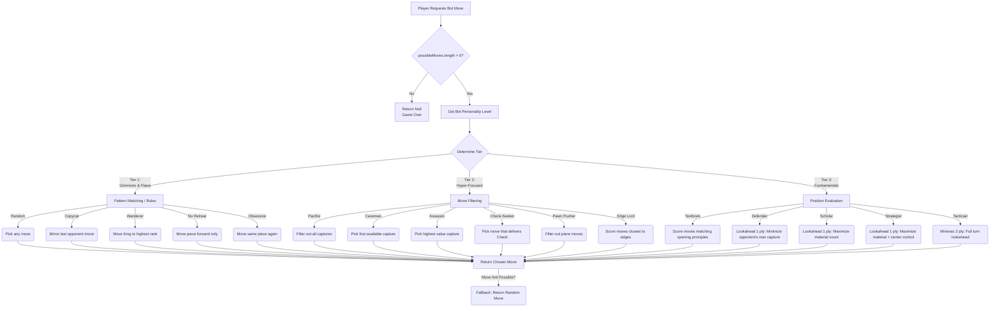
```mermaid
graph TD
    A[Player Requests Bot Move] --> B{possibleMoves.length > 0?}
    B -- No --> C[Return Null<br>Game Over]
    B -- Yes --> D[Get Bot Personality Level]
    
    D --> E{Determine Tier}
    
    E -- Tier 1:<br>Gimmicks & Flaws --> F[Pattern Matching / Rules]
    F --> |Random| F1(Pick any move)
    F --> |Copycat| F2(Mirror last opponent move)
    F --> |Wanderer| F3(Move King to highest rank)
    F --> |No Retreat| F4(Move piece forward only)
    F --> |Obsessive| F5(Move same piece again)
    
    E -- Tier 2:<br>Hyper-Focused --> G[Move Filtering]
    G --> |Pacifist| G1(Filter out all captures)
    G --> |Caveman| G2(Pick first available capture)
    G --> |Assassin| G3(Pick highest value capture)
    G --> |Check-Seeker| G4(Pick move that delivers Check)
    G --> |Pawn Pusher| G5(Filter out piece moves)
    G --> |Edge Lord| G6(Score moves closest to edges)
    
    E -- Tier 3:<br>Fundamentals --> H[Position Evaluation]
    H --> |Textbook| H1(Score moves matching opening principles)
    H --> |Defender| H2(Lookahead 1 ply: Minimize opponent's max capture)
    H --> |Scholar| H3(Lookahead 1 ply: Maximize material count)
    H --> |Strategist| H4(Lookahead 1 ply: Maximize material + center control)
    H --> |Tactician| H5(Minimax 2 ply: Full turn lookahead)
    
    F1 --> Z[Return Chosen Move]
    F2 --> Z
    F3 --> Z
    F4 --> Z
    F5 --> Z
    G1 --> Z
    G2 --> Z
    G3 --> Z
    G4 --> Z
    G5 --> Z
    G6 --> Z
    H1 --> Z
    H2 --> Z
    H3 --> Z
    H4 --> Z
    H5 --> Z
    
    Z --> |Move Not Possible?| Y(Fallback: Return Random Move)
```

### 1. Execution Pipeline & Fallback Architecture

This flowchart illustrates the execution lifecycle of `getMove()`, highlighting how candidate moves are filtered or scored, and how state safety is maintained via `game.undo()` during evaluation.

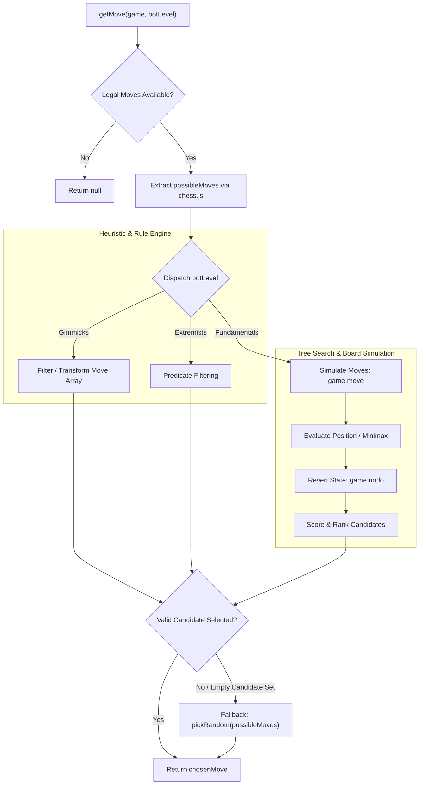
```mermaid
flowchart TD
    A["getMove(game, botLevel)"] --> B{Legal Moves Available?}
    B -- No --> C[Return null]
    B -- Yes --> D[Extract possibleMoves via chess.js]
    
    D --> E{Dispatch botLevel}

    subgraph Heuristic & Rule Engine
        E -->|Gimmicks| F[Filter / Transform Move Array]
        E -->|Extremists| G[Predicate Filtering]
    end

    subgraph Tree Search & Board Simulation
        E -->|Fundamentals| H[Simulate Moves: game.move]
        H --> I[Evaluate Position / Minimax]
        I --> J[Revert State: game.undo]
        J --> K[Score & Rank Candidates]
    end

    F --> L{Valid Candidate Selected?}
    G --> L
    K --> L

    L -- Yes --> M[Return chosenMove]
    L -- No / Empty Candidate Set --> N["Fallback: pickRandom(possibleMoves)"]
    N --> M
```

#### Developer Notes

* **State Safety:** Evaluator bots (`defender`, `scholar`, `strategist`, `tactician`) mutate the `chess.js` instance using `game.move(m)` to calculate values and **must** invoke `game.undo()` inside the loop to preserve board integrity.
* **Fail-Safe Guarantee:** If a personality's constraints yield an empty set (e.g., `pacifist` when only captures are legal, or `copycat` when the mirrored square is blocked), the module gracefully falls back to `pickRandom(possibleMoves)`.

---

### 2. Decision Complexity & Algorithm Categorization

This diagram breaks down the 15 bot personalities by their underlying decision-making algorithms and computational complexity.

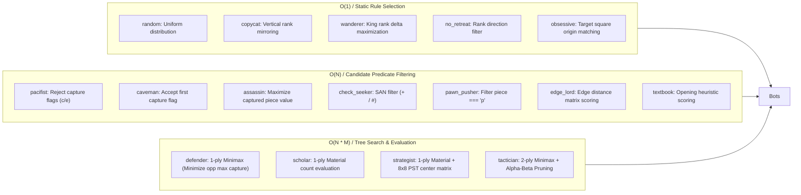
```mermaid
graph LR
    subgraph O_1["O(1) / Static Rule Selection"]
        direction TB
        random["random: Uniform distribution"]
        copycat["copycat: Vertical rank mirroring"]
        wanderer["wanderer: King rank delta maximization"]
        no_retreat["no_retreat: Rank direction filter"]
        obsessive["obsessive: Target square origin matching"]
    end

    subgraph O_N["O(N) / Candidate Predicate Filtering"]
        direction TB
        pacifist["pacifist: Reject capture flags (c/e)"]
        caveman["caveman: Accept first capture flag"]
        assassin["assassin: Maximize captured piece value"]
        check_seeker["check_seeker: SAN filter (+ / #)"]
        pawn_pusher["pawn_pusher: Filter piece === 'p'"]
        edge_lord["edge_lord: Edge distance matrix scoring"]
        textbook["textbook: Opening heuristic scoring"]
    end

    subgraph O_N_Ply["O(N * M) / Tree Search & Evaluation"]
        direction TB
        defender["defender: 1-ply Minimax (Minimize opp max capture)"]
        scholar["scholar: 1-ply Material count evaluation"]
        strategist["strategist: 1-ply Material + 8x8 PST center matrix"]
        tactician["tactician: 2-ply Minimax + Alpha-Beta Pruning"]
    end

    O_1 --> Bots
    O_N --> Bots
    O_N_Ply --> Bots
```

#### Algorithmic Breakdown

* **Static Heuristics ($O(1)$ to $O(N)$):** Selects or filters moves in a single pass over the immediate legal moves array without deep position calculation.
* **1-Ply Search with Custom Evaluators ($O(N \cdot M)$):** Pushes each candidate move, evaluates the board state (using raw material values or Piece-Square Tables), and rolls back state before selecting the optimal move.
* **2-Ply Minimax with Alpha-Beta Pruning ($O(N \cdot M)$):** Pushes candidate move $M_1$, simulates all opponent replies $M_2$, evaluates terminal leaves, and uses standard Alpha-Beta pruning to reject sub-optimal branches.

## Tier 1: The Gimmicks (Chaos & Flaws)

### 1. Random (Chaos)

Selects a uniformly distributed random index from the array of legal moves.

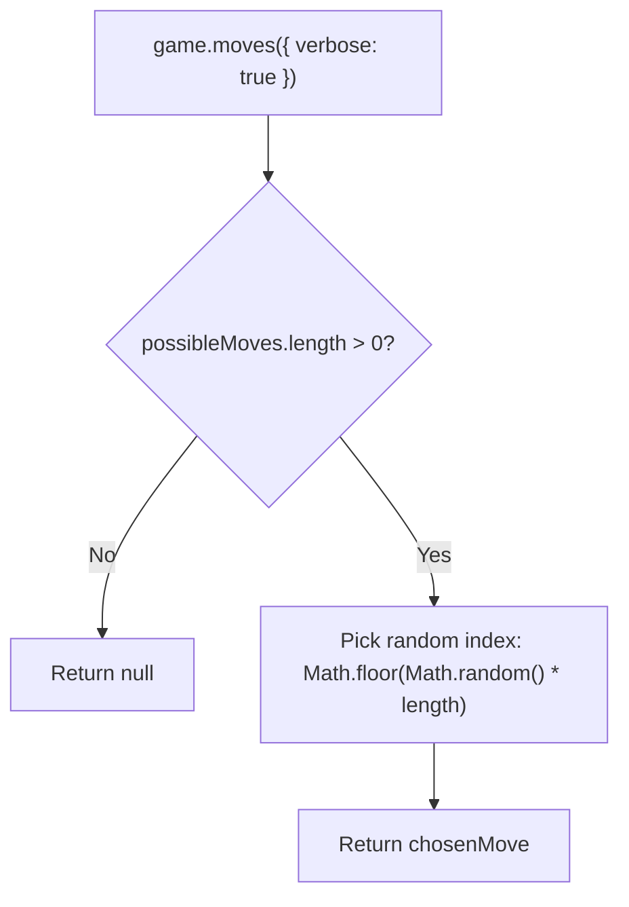
```mermaid
flowchart TD
    A["game.moves({ verbose: true })"] --> B{"possibleMoves.length > 0?"}
    B -- No --> C["Return null"]
    B -- Yes --> D["Pick random index: Math.floor(Math.random() * length)"]
    D --> E["Return chosenMove"]

```

---

### 2. Copycat (The Mirror)

Attempts to mirror the opponent's previous move vertically across the board.

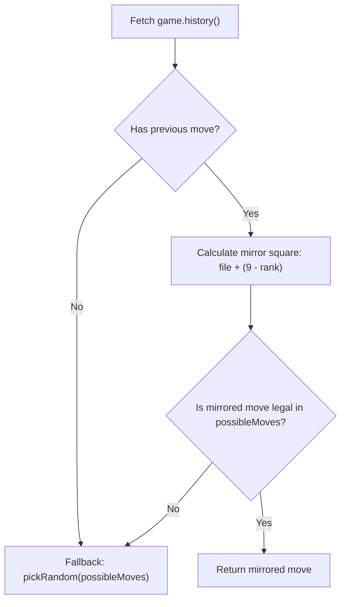
```mermaid
flowchart TD
    A["Fetch game.history()"] --> B{"Has previous move?"}
    B -- No --> C["Fallback: pickRandom(possibleMoves)"]
    B -- Yes --> D["Calculate mirror square: file + (9 - rank)"]
    D --> E{"Is mirrored move legal in possibleMoves?"}
    E -- Yes --> F["Return mirrored move"]
    E -- No --> C

```

---

### 3. Wanderer (The Marching King)

Prioritizes advancing the King forward toward the opponent's side of the board.

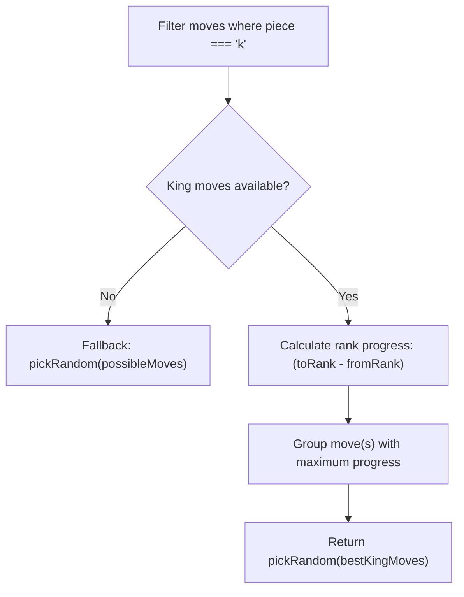
```mermaid
flowchart TD
    A["Filter moves where piece === 'k'"] --> B{"King moves available?"}
    B -- No --> C["Fallback: pickRandom(possibleMoves)"]
    B -- Yes --> D["Calculate rank progress: (toRank - fromRank)"]
    D --> E["Group move(s) with maximum progress"]
    E --> F["Return pickRandom(bestKingMoves)"]

```

---

### 4. No Retreat (The Commando)

Filter out moves that retreat backward relative to the bot's color.

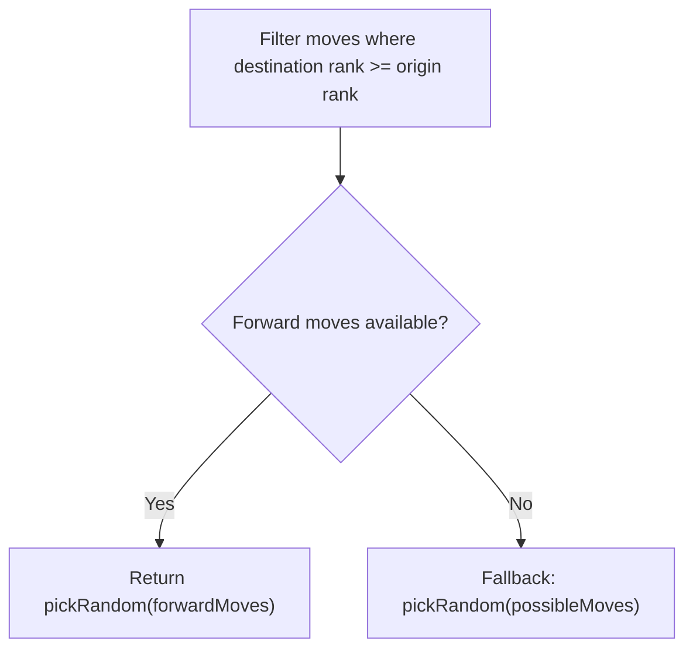
```mermaid
flowchart TD
    A["Filter moves where destination rank >= origin rank"] --> B{"Forward moves available?"}
    B -- Yes --> C["Return pickRandom(forwardMoves)"]
    B -- No --> D["Fallback: pickRandom(possibleMoves)"]

```

---

### 5. Obsessive (Tunnel Vision)

Attempts to move the exact piece that it moved on its previous turn.

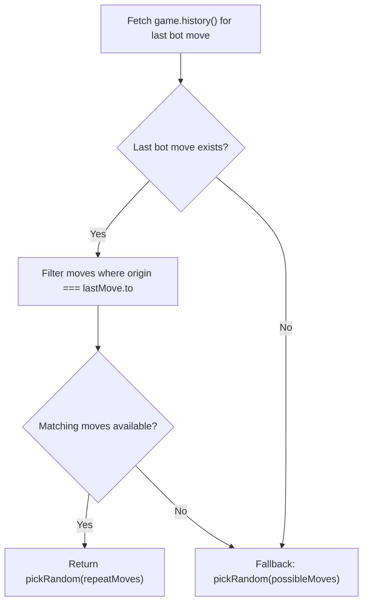
```mermaid
flowchart TD
    A["Fetch game.history() for last bot move"] --> B{"Last bot move exists?"}
    B -- Yes --> C["Filter moves where origin === lastMove.to"]
    C --> D{"Matching moves available?"}
    D -- Yes --> E["Return pickRandom(repeatMoves)"]
    B -- No --> F["Fallback: pickRandom(possibleMoves)"]
    D -- No --> F

```

---

## Tier 2: The Extremists (Hyper-Focused)

### 6. Pacifist (No Captures)

Refuses to capture opponent pieces unless forced by check or staleness.

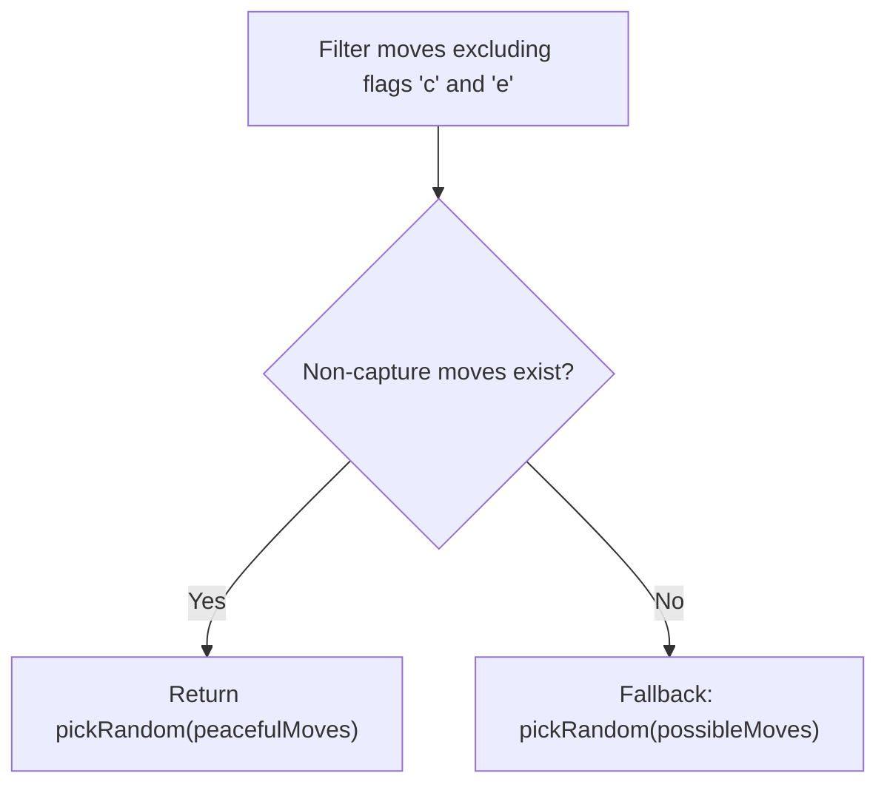
```mermaid
flowchart TD
    A["Filter moves excluding flags 'c' and 'e'"] --> B{"Non-capture moves exist?"}
    B -- Yes --> C["Return pickRandom(peacefulMoves)"]
    B -- No --> D["Fallback: pickRandom(possibleMoves)"]

```

---

### 7. Caveman (First Capture)

Plays a capture move immediately if available, ignoring piece value or tactical danger.

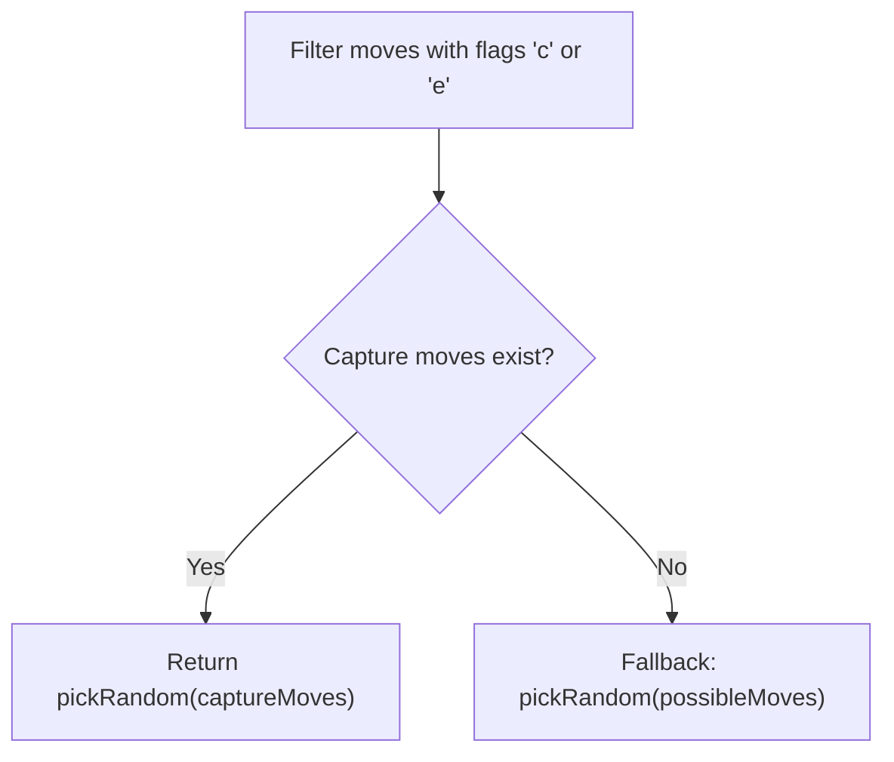
```mermaid
flowchart TD
    A["Filter moves with flags 'c' or 'e'"] --> B{"Capture moves exist?"}
    B -- Yes --> C["Return pickRandom(captureMoves)"]
    B -- No --> D["Fallback: pickRandom(possibleMoves)"]

```

---

### 8. Assassin (Greedy Captures)

Evaluates all available captures and selects the move capturing the highest-value piece.

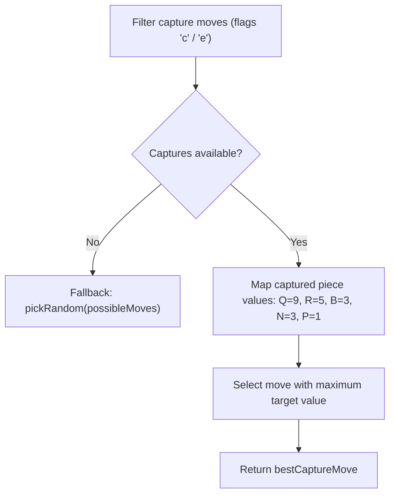
```mermaid
flowchart TD
    A["Filter capture moves (flags 'c' / 'e')"] --> B{"Captures available?"}
    B -- No --> C["Fallback: pickRandom(possibleMoves)"]
    B -- Yes --> D["Map captured piece values: Q=9, R=5, B=3, N=3, P=1"]
    D --> E["Select move with maximum target value"]
    E --> F["Return bestCaptureMove"]

```

---

### 9. Check Hunter (Check-Seeker)

Prioritizes playing any move that results in check or checkmate (`+` or `#`).

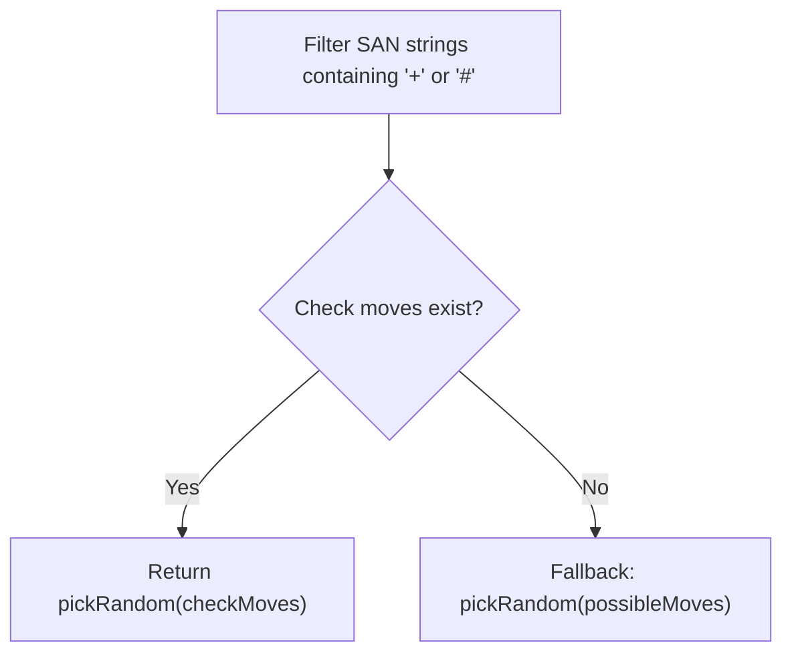
```mermaid
flowchart TD
    A["Filter SAN strings containing '+' or '#'"] --> B{"Check moves exist?"}
    B -- Yes --> C["Return pickRandom(checkMoves)"]
    B -- No --> D["Fallback: pickRandom(possibleMoves)"]

```

---

### 10. The Farmer (Pawn Pusher)

Prioritizes pawn moves over developing or moving minor/major pieces.

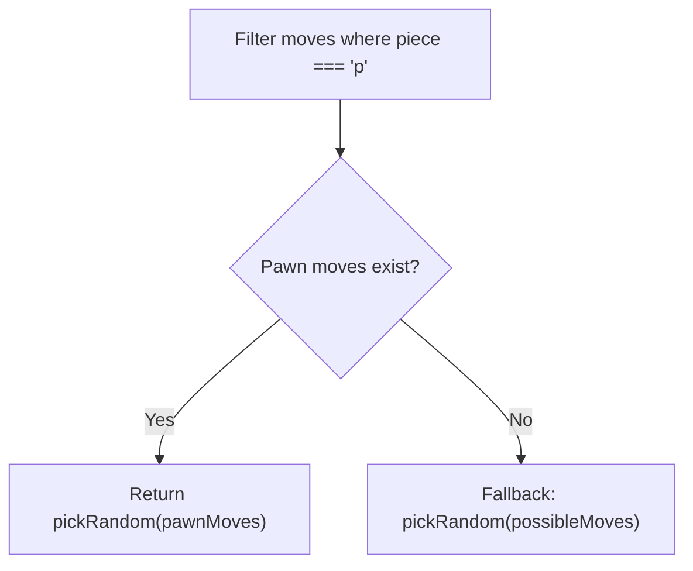
```mermaid
flowchart TD
    A["Filter moves where piece === 'p'"] --> B{"Pawn moves exist?"}
    B -- Yes --> C["Return pickRandom(pawnMoves)"]
    B -- No --> D["Fallback: pickRandom(possibleMoves)"]

```

---

### 11. Edge Lord (The Flanker)

Scores moves based on their proximity to the perimeter files (`a`, `h`) and ranks (`1`, `8`).

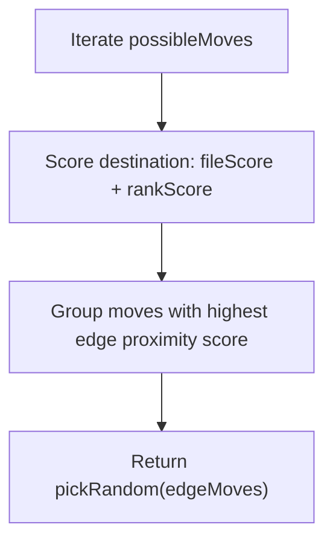
```mermaid
flowchart TD
    A["Iterate possibleMoves"] --> B["Score destination: fileScore + rankScore"]
    B --> C["Group moves with highest edge proximity score"]
    C --> D["Return pickRandom(edgeMoves)"]

```

---

## Tier 3: Fundamental Logic

### 12. The Purist (Textbook Opening)

Scores legal moves against classic chess opening principles.

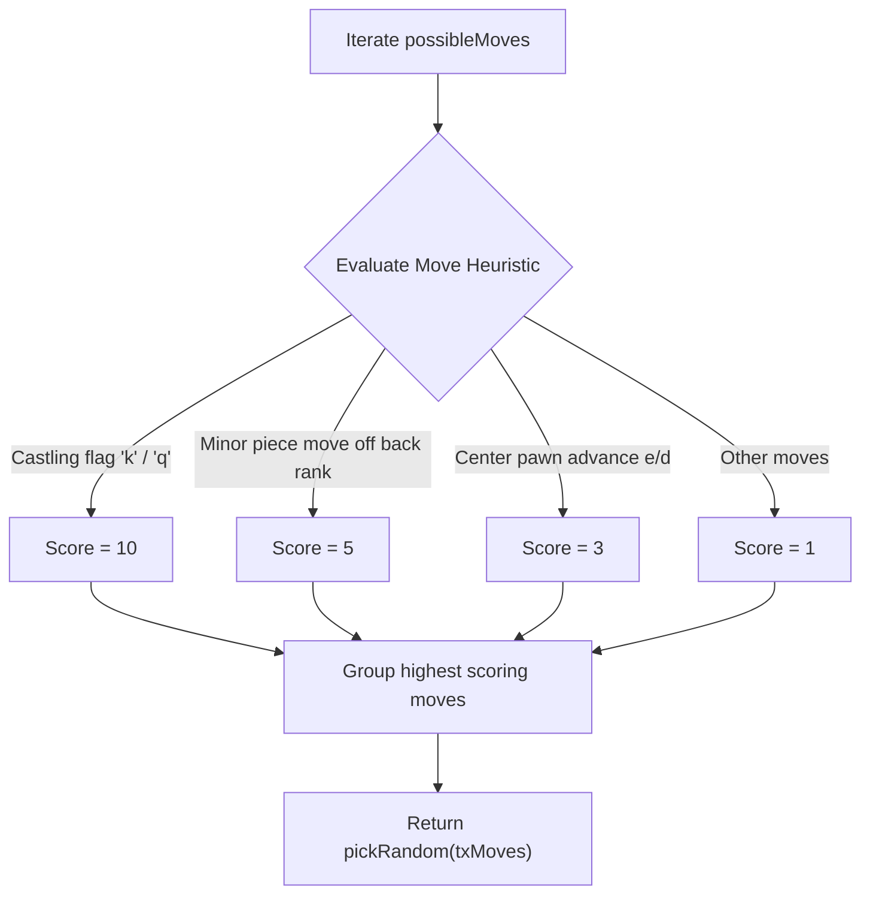
```mermaid
flowchart TD
    A["Iterate possibleMoves"] --> B{"Evaluate Move Heuristic"}
    B -->|Castling flag 'k' / 'q'| C["Score = 10"]
    B -->|Minor piece move off back rank| D["Score = 5"]
    B -->|Center pawn advance e/d| E["Score = 3"]
    B -->|Other moves| F["Score = 1"]
    C & D & E & F --> G["Group highest scoring moves"]
    G --> H["Return pickRandom(txMoves)"]

```

---

### 13. Self-Preservation (Defender)

Simulates candidate moves to pick the line that minimizes the opponent's maximum capture value on the next ply.

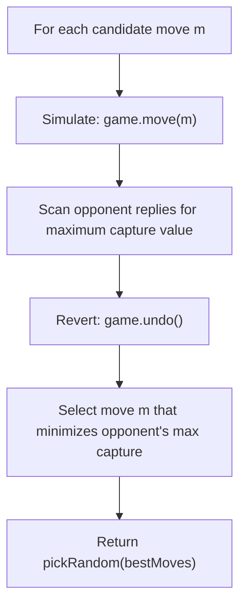
```mermaid
flowchart TD
    A["For each candidate move m"] --> B["Simulate: game.move(m)"]
    B --> C["Scan opponent replies for maximum capture value"]
    C --> D["Revert: game.undo()"]
    D --> E["Select move m that minimizes opponent's max capture"]
    E --> F["Return pickRandom(bestMoves)"]

```

---

### 14. The Scholar (Material Count)

A 1-ply evaluation counting total material remaining on the board after the move.

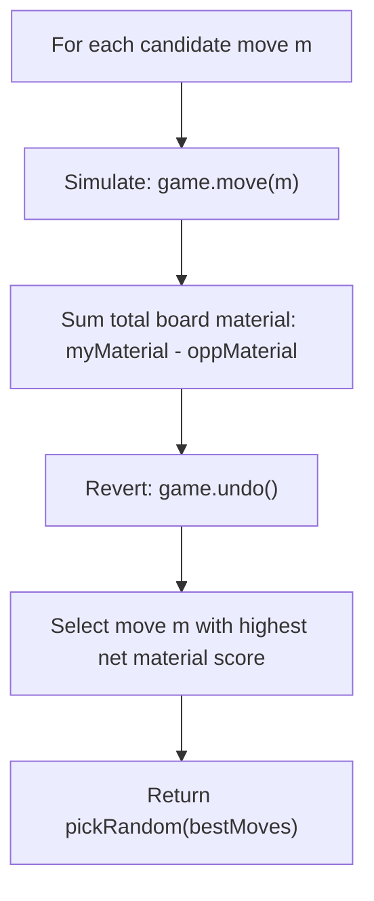
```mermaid
flowchart TD
    A["For each candidate move m"] --> B["Simulate: game.move(m)"]
    B --> C["Sum total board material: myMaterial - oppMaterial"]
    C --> D["Revert: game.undo()"]
    D --> E["Select move m with highest net material score"]
    E --> F["Return pickRandom(bestMoves)"]

```

---

### 15. The Strategist (Center Control)

Combines material evaluation with a static 8x8 Piece-Square Table (PST) rewarding central square occupancy.

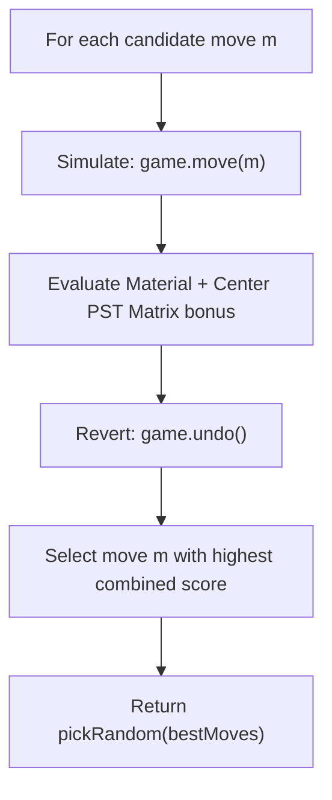
```mermaid
flowchart TD
    A["For each candidate move m"] --> B["Simulate: game.move(m)"]
    B --> C["Evaluate Material + Center PST Matrix bonus"]
    C --> D["Revert: game.undo()"]
    D --> E["Select move m with highest combined score"]
    E --> F["Return pickRandom(bestMoves)"]

```

---

### 16. The Tactician (2-Ply Minimax)

Executes a 2-ply Minimax tree search with Alpha-Beta pruning to evaluate the opponent's optimal response.

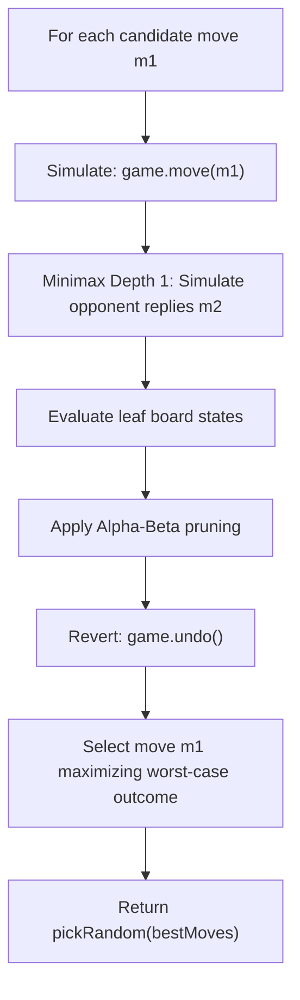
```mermaid
flowchart TD
    A["For each candidate move m1"] --> B["Simulate: game.move(m1)"]
    B --> C["Minimax Depth 1: Simulate opponent replies m2"]
    C --> D["Evaluate leaf board states"]
    D --> E["Apply Alpha-Beta pruning"]
    E --> F["Revert: game.undo()"]
    F --> G["Select move m1 maximizing worst-case outcome"]
    G --> H["Return pickRandom(bestMoves)"]

```